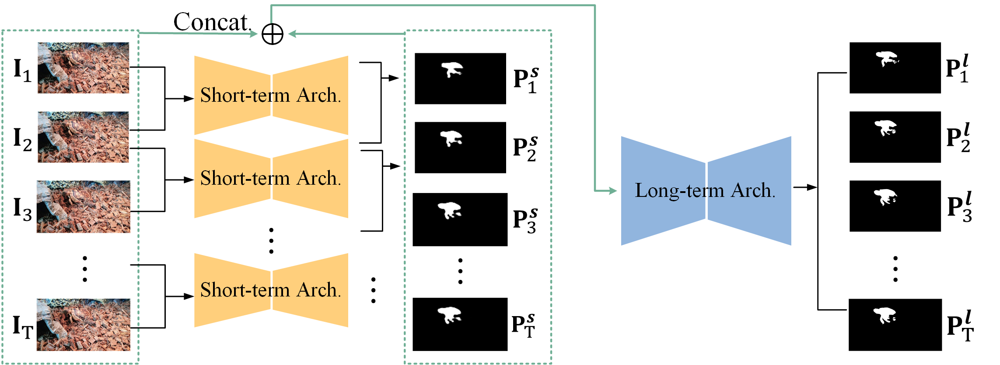

## SLT-Net

This repository contains the code for our CVPR 2022 paper `Implicit Motion Handling for Video Camouflaged Object Detection` [[CVPR 2022](https://openaccess.thecvf.com/content/CVPR2022/papers/Cheng_Implicit_Motion_Handling_for_Video_Camouflaged_Object_Detection_CVPR_2022_paper.pdf)] [[arXiv](http://arxiv.org/abs/2203.07363)] [[Project Page](https://xueliancheng.github.io/SLT-Net-project/)] 

SLT-Net: we propose a new video camouflaged object detection (VCOD) framework that can use both short-term dynamics and long-term temporal consistency to detect camouflaged objects from video frames.
<!--  -->

## 1. Features

**Summary.** This repository contains the source code, prediction results, and evaluation toolbox in `eval` folder.

**Demo_videos.** In `Videos` folder, we demonstrate the video results of our SLT-Net, and two top-performing baselines (including SINet, RCRNet) on MoCA-Mask test dataset.

**Results.** The results of all compared methods and the whole MoCA-Mask datset could be found [here](https://drive.google.com/drive/folders/1iQyFXCGhknRzsXk9m5KBnnGeig7F1Snm?usp=sharing). 


## 2. Proposed Framework

<p align="left">
     <br />
    <em>
    Figure 1: The overall pipeline of the SLT-Net. The SLT-Net consists of a short-term detection module and a long-term refinement module. The short-term detection module takes a pair of consecutive frames and predicts the camouflaged object mask for the reference frame. The long-term refinement module takes T predictions from the short-term detection module along with their corresponding referenced frames to generate the final predictions.
    </em>
</p>

The training and testing experiments are conducted using [PyTorch](https://github.com/pytorch/pytorch) with 
a single NVIDIA V100 GPU of 32 GB Memory.

> Note that our model also supports low memory GPU, which means you should lower the batch size.

## 3. Preparation

**Requirements.** 
1. Python 3.9.*
2. CUDA 11.1
3. PyTorch 
4. TorchVision 

**Install.** 
Create a  virtual environment and activate it.
```shell
conda create -n SLTnet python=3.8
conda activate SLTnet
```
The code has been tested with PyTorch 1.9 and Cuda 11.1.
```shell
conda install pytorch torchvision torchaudio cudatoolkit=11.1 -c pytorch -c nvidia
conda install -c conda-forge timm
```
Install MMCV + MMSegmentation

Follow the instructions [here](https://mmcv.readthedocs.io/en/latest/get_started/installation.html). MMCV and MMSegmentation are required for training the transformer encoder. A quick installation example:

```shell
pip install mmcv-full -f https://download.openmmlab.com/mmcv/dist/cu111/torch1.9.0/index.html
pip install mmsegmentation
```

For the seq-to-seq model of long-term architecture, the core is built on CUDA OP with torchlib. 
Please could find more details in [Github](https://github.com/GewelsJI/PNS-Net). A quick installation example:

```shell
cd ./lib/ref_video/PNS
python setup.py build develop
```

**Dataset.** 
To evaluate/train our SLT-Net network, you will need to download the required datasets. Noting that, If you want to use our Pseudo labels, please download via [MoCA-Mask-Pseudo].

* [MoCA-Mask](https://drive.google.com/file/d/1FB24BGVrPOeUpmYbKZJYL5ermqUvBo_6/view?usp=sharing), [MoCA-Mask-Pseudo](https://drive.google.com/file/d/1a7ESYE30q5MHsmrfTasNEOsbjdpZdgz5/view?usp=sharing)
* [CAD2016](http://vis-www.cs.umass.edu/motionSegmentation/)
* [COD10K](https://drive.google.com/file/d/1vRYAie0JcNStcSwagmCq55eirGyMYGm5/view)

Change the first column path in file `create_link.sh` with your actual dataset location. Then run `create_link.sh` that will create symbolic links to wherever the datasets were downloaded in the `dataset` folder. 

```Shell
├── datasets
    ├── MoCA-Mask
    ├── CAD2016
    ├── COD10K
```
Notting that for CAD2016 dataset, the original ground-truth maps were labelled as 1/2 index for each pixel. You need to transfer it as 0/255. We also provide the transformed new gt [here](https://drive.google.com/file/d/1LwswF3axQ0BSC6DllTpyL77Ktruy-6M6/view?usp=sharing) at your ease. 

## 3. Results

**Prediction.** 
You can evaluate a trained model using `prediction.sh` for each dataset, which would help you generate *.png images corresponding to different datasets.
```shell
sh test_video.sh
sh test_video_long_term.sh
```

**Evaluation.** 
Please run the file `main_CAD.m` or `main_MoCA.m`  in `eval` folder to evaluate your model. You could also simply download the images via this [Link](https://drive.google.com/drive/folders/1iQyFXCGhknRzsXk9m5KBnnGeig7F1Snm?usp=sharing) to reach the results reported in our paper. Or download our pre-trained model via this link: [snapshot](https://drive.google.com/file/d/1_u4dEdxM4AKuuh6EcWHAlo8EtR7e8q5v/view?usp=sharing). [If you download it before 7 Sep 2022, please replace it with the new version. The Net_epoch_cod10k.pth in previous snapshpt is wrong with Resnet pretrained weights.]

**Acknowledgements.** 
Please find more information about the original MoCA dataset [1] [Link](https://www.robots.ox.ac.uk/~vgg/data/MoCA/).

[1] Hala Lamdouar and Charig Yang and Weidi Xie and Andrew Zisserman
Betrayed by Motion: Camouflaged Object Discovery via Motion Segmentation 
Asian Conference on Computer Vision, 2020

## 4. Citing

If you find this code useful, please consider to cite our work.
```shell
@inproceedings{cheng2022implicit,
  title={Implicit Motion Handling for Video Camouflaged Object Detection},
  author={Cheng, Xuelian and Xiong, Huan and Fan, Deng-Ping and Zhong, Yiran and Harandi, Mehrtash and Drummond, Tom and Ge, Zongyuan},
  booktitle={CVPR},
  year={2022}
}
```

